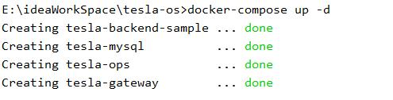
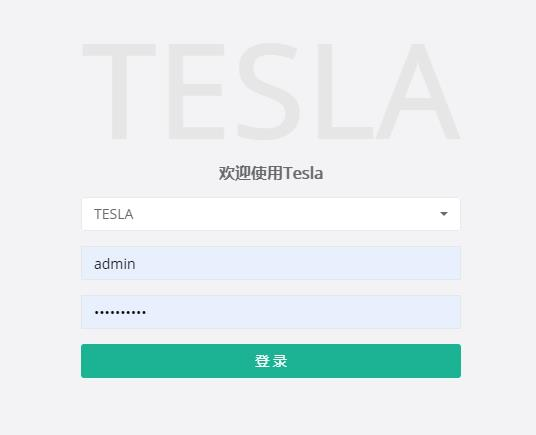

# 概述

Tesla是一个基于netty的微服务API网关，可以为公司内部系统提供统一的，安全的入口服务，并通过多种可配置的插件灵活的实现自己需要的功能。

tesla由tesla-ops(tesla管理控制台)和tesla-gateway(tesla网关)两个服务组成，开发和使用人员在osg-ops上进行服务发布和调用方接入配置。

* 服务发布：通过在tesla-ops的API管理菜单处进行配置，可将自己的服务通过tesla-gateway发布出去，其他系统可通过tesla-gateway访问到后端服务。
* 接入配置：外部系统想通过tesla-gateway调用已发布的服务，可通过tesla-ops的接入管理菜单处进行配置，设置访问权限等功能。

tesla还与summerframework结合，通过gateway为入口，实现了整个调用链的灰度节点选择。

# 功能

* 支持Dubbo，将http请求转换为Dubbo请求
* 支持Spring cloud 路由和直接路由
* 支持限流、Oauth2鉴权、Jwt鉴权，准入控制，Ip黑名单、Cookie黑名单、URL黑名单，UA黑名单等规则的限制
* 支持监控，通过micrometer在整个请求转发链的关键位置打点，可输出到influxdb，配合grafana进行可视化监控
* 支持动态路由规则的定义
* 支持参数裁剪及参数转换
* 支持通过规则引擎及参数转换支持API的编排
* 有OPS管理控制平台，维护简单
* 不依赖于Web容器，基于Netty的开发，在性能上要比Zuul要好
* 通过配置插件的形式支持路由时各种规则的自定义
* 支持Docker

# 插件列表
* 请求头转换插件：可对请求头和响应头进行配置化定制
* 鉴权配置插件：支持JWT和OAUTH2鉴权
* 限流配置插件：使用分布式令牌桶的形式对每个服务进行差别化限流
* 请求报文校验插件：采用json schema对报文体或部分报文体的格式校验
* Groovy脚本插件：可动态在调用链中插入一段java脚本，来执行需要的逻辑
* Mock插件：mock请求结果，配置该插件后，请求不会再转发给后端服务，根据配置好的freemarker模板直接响应给调用方
* Rpc路由转换插件：配置将http请求转化为dubbo请求时需要的参数，如服务名，参数转化逻辑
* Url重写插件：该插件可对osg请求到后端的url进行差异化配置，支持直接转发和占位符转发
* 创建token插件：可根据响应报文内容抽取参数后生成JWT
* 执行上传jar包插件：如果有特殊化的功能，当前插件体系无法满足时，可以使用该插件自己编写逻辑
* 查询聚合插件：该插件可实现调用方一次查询，聚合多个后端接口数据的效果
* 消除鉴权插件：该插件用于当API的鉴权类型不是开放时，但个别endpoint不希望鉴权时使用，如/login，/logout等
* 签名校验插件：调用方使用签名工具对请求进行签名，osg会根据验证签名的有效性，防止请求数据被篡改
* 缓存结果插件：该插件可根据配置缓存请求结果
* 请求报文转换插件：该插件根据配置的freemarker脚本对请求体和响应体的报文进行转换

具体插件使用方法请参考PDF版文档

 
# 使用说明

 * mvn打包及打镜像
 
 ```
   # Tesla项目依赖于tesla-auth项目的SDK包，先install tesla-auth
   > cd tesla-auth
   > mvn clean -DskipTests install
   
   #tesla-sample下编写了一个模拟的后端服务，可直观的看到运行效果
   > cd ../tesla-sample
   > mvn clean -DskipTests package
   
   #打包tesla
   > cd ..
   > mvn clean package
 ```
 
 * 在根目录下运行,成功如下图
 
 ```
 docker-compose up -d
 ```
 
 
 * 访问ops控制台,默认管理员账号密码：admin/Password@1,进行规则的配置
 http://localhost:8080
 
 
 
 * 访问gateway真正路由转发
  http://localhost:9000